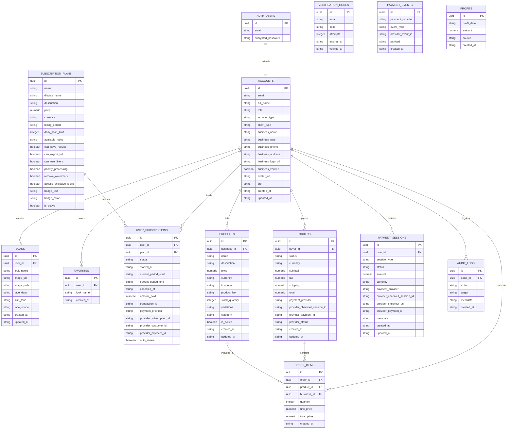
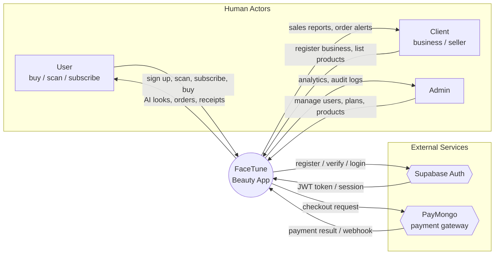
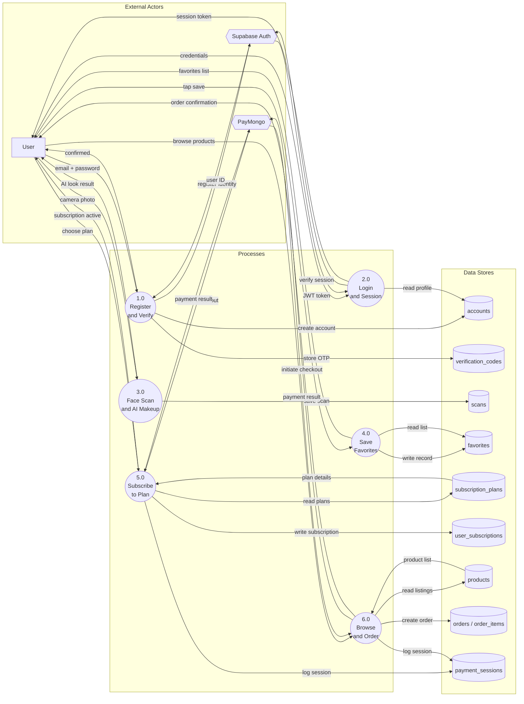
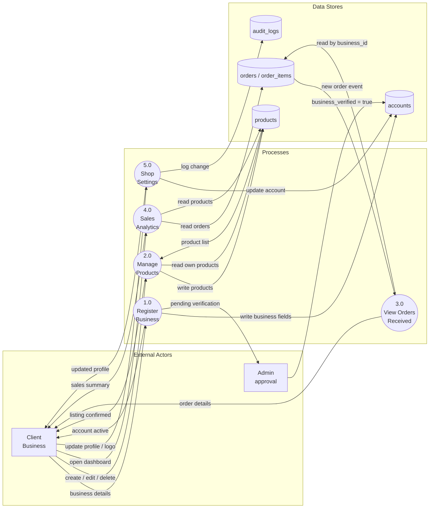
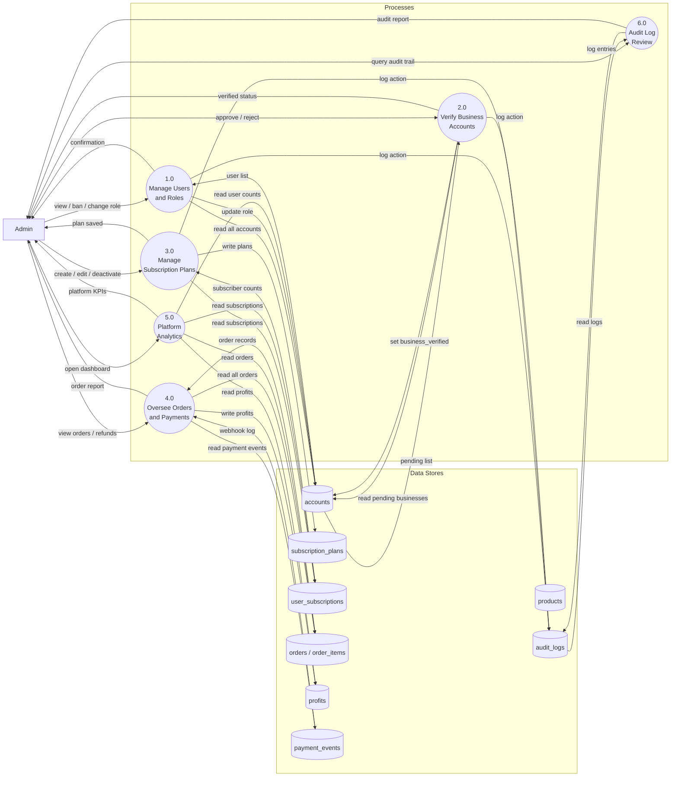

# FaceTune Beauty — ERD & DFD

> Generated from the live database schema (`database/schema.sql`, `database/paymongo_schema.sql`, `database/create_products_schema.sql`).
> Three roles: **User** (buyer/scanner), **Client** (business/seller), **Admin** (platform manager).

---

## 1. Entity Relationship Diagram (ERD)

---

## 2. DFD — Level 0: Context Diagram

High-level view of the whole system and all external actors.

---

## 3. DFD — Level 1: User Flows

All data flows triggered by the **User** role (regular account, buyer, scanner).

---

## 4. DFD — Level 1: Client Flows

All data flows triggered by the **Client** role (business account / seller).

---

## 5. DFD — Level 1: Admin Flows

All data flows triggered by the **Admin** role (platform operator).

---

## 6. Role–Table Access Matrix

| Table | User read | User write | Client read | Client write | Admin read | Admin write |
|---|:---:|:---:|:---:|:---:|:---:|:---:|
| `accounts` | own only | own only | own only | own only | all | all |
| `verification_codes` | own only | own only | own only | own only | — | — |
| `scans` | own only | own only | — | — | all | — |
| `favorites` | own only | own only | — | — | — | — |
| `subscription_plans` | active only | — | active only | — | all | all |
| `user_subscriptions` | own only | — | — | — | all | all |
| `products` | active only | — | own only | own only | all | all |
| `orders` | own only | own only | own sales | — | all | all |
| `order_items` | own only | own only | own business | — | all | all |
| `payment_sessions` | own only | own only | — | — | all | all |
| `payment_events` | — | — | — | — | all | — |
| `profits` | — | — | — | — | all | all |
| `audit_logs` | — | — | — | — | all | all |
